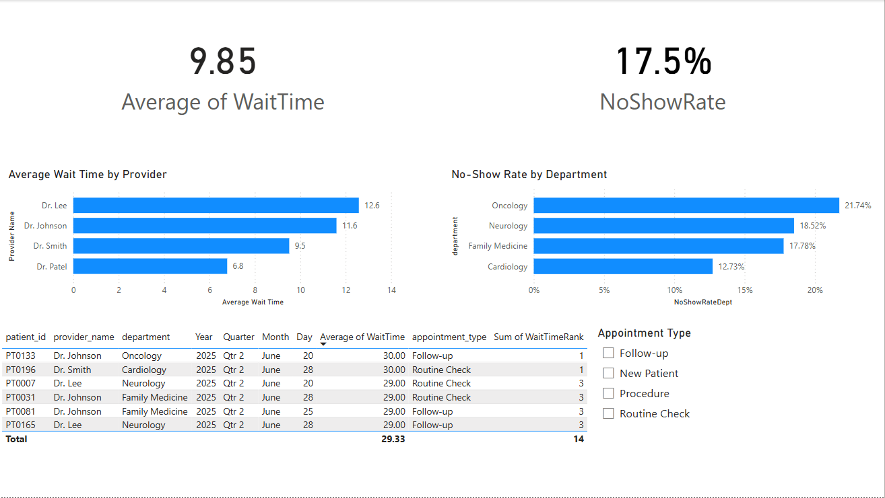

# Epic Business Intelligence Analyst Project – Outpatient Efficiency Dashboard

This project was created by Brayden Johnson to demonstrate analytical, technical, and communication skills aligned with the responsibilities of an Epic Business Intelligence Analyst. It simulates the development of operational insights using Epic-like data, focusing on outpatient efficiency.

## Objective

To simulate how a BI Analyst might use Epic Clarity or Caboodle data to identify trends in patient wait times and no-show rates. The goal is to improve clinical efficiency and support better resource allocation and patient satisfaction.

## Tools and Technologies

- **Python**: Used to generate a realistic mock dataset of outpatient appointments
- **Power BI**: Used to model, analyze, and visualize operational insights
- **DAX**: Used to calculate key metrics such as average wait time and appointment duration

## Files Included

| File                                 | Description                                                |
|--------------------------------------|------------------------------------------------------------|
| `BraydenJohnson_EpicBIAnalyst_ProjectSummary.pdf` | One-page executive summary of the project             |
| `generate_mock_epic_data.py`         | Python script used to create the mock Epic dataset         |
| `mock_epic_appointment_data.csv`     | Simulated outpatient appointment data                      |
| `epic_power_bi_visual.pbix`          | Power BI dashboard file showing analysis and visuals       |

## Key Metrics and Visuals

- **Average Wait Time** by Provider (KPI and bar chart)
- **No-Show Rate** by Department (KPI and bar chart)
- **Top 5 Longest Wait Time Appointments** (ranked table)
- **Slicer for Appointment Type** (interactive filter)

## Sample Insights

- One provider had average wait times over 12 minutes, significantly above peers
- Neurology and Oncology departments showed the highest no-show rates, each over 18 percent
- Several appointments with long wait times were clustered in a short time frame, suggesting scheduling bottlenecks

## Why This Matters

This project demonstrates how I would approach BI report development at Freeman Health System. It shows my ability to:
- Translate raw data into actionable insights
- Collaborate with stakeholders around workflow issues
- Support performance monitoring through scalable, repeatable reporting

